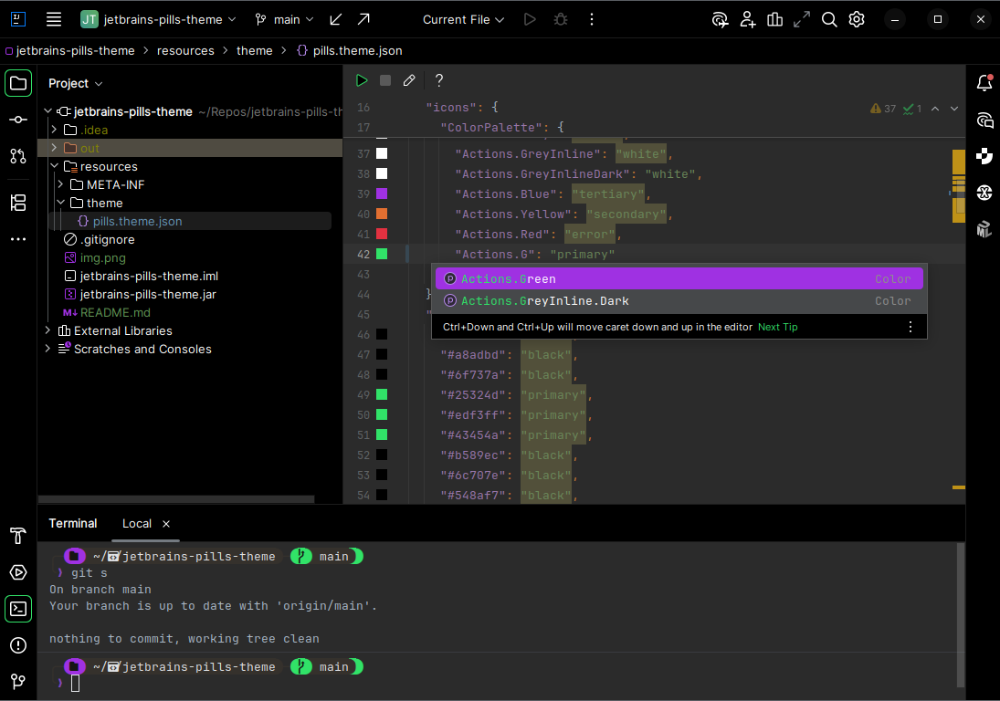

# JetBrains IDE Theme: Pills

This is a dark theme with punchy neon like colors. Designed to go along nicely with my starship terminal theme which you can also see it the screenshot.
Starship.toml: https://github.com/reifenrath-dev/dotfiles/blob/main/starship-pills.toml

# Installation
You can check out the repository and compile the theme by yourself or download the compiled plugin from the source code: [jetbrains-pills-theme.jar](jetbrains-pills-theme.jar)